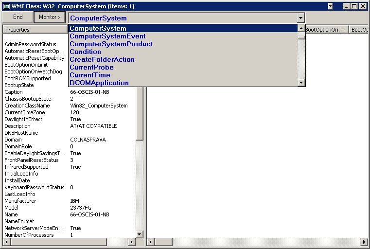



## WMI monitor

### Description

Monitoring local or remote PCs and servers by way of WMI (Windows Management Instrumentation). There is 286 Win32_Classes from WMI.
 
### More Info
 

             |
---                |---
**Submitted On**   |2004-10-19 06:53:02
**By**             |[Bruno69](https://github.com/Planet-Source-Code/PSCIndex/blob/master/ByAuthor/bruno69.md)
**Level**          |Advanced
**User Rating**    |5.0 (25 globes from 5 users)
**Compatibility**  |VB 6\.0, VB Script
**Category**       |[Complete Applications](https://github.com/Planet-Source-Code/PSCIndex/blob/master/ByCategory/complete-applications__1-27.md)
**World**          |[Visual Basic](https://github.com/Planet-Source-Code/PSCIndex/blob/master/ByWorld/visual-basic.md)
**Archive File**   |[WMI\_monito18076610192004\.zip](https://github.com/Planet-Source-Code/bruno69-wmi-monitor__1-56823/archive/master.zip)

